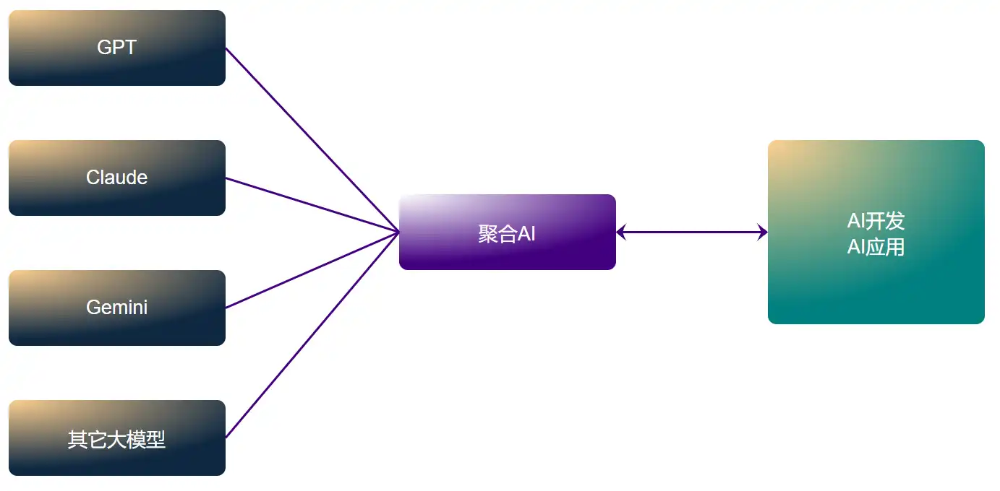

# 聚合AI，让全球顶级AI大模型人人可用

`纯官转API` `超高并发` `无需魔法` `可用性≥99%` `多种模型`

## 概述

聚合AI是一个大模型集成平台，包含OpenAI、Anthropic、Gemini及中国主流大模型。您通过购买聚合AI，即可方便快速实现多家大模型的统一调用，如gpt-4o、claude-3-opus、gemini-pro-1.5等，[已支持模型清单>>](cn/ModelList.md)。

如果您是非允许使用国家的用户，如果在官方网站购买，要考虑如何绕过官方IP审查、封号等复杂问题，这并不是每个用户所擅长的，会消耗大量的精力和时间，试错成本极高。

选择聚合AI平台即可免去在多家AI公司注册、认证和绑卡购买的过程，让您完全回归需求本质，专注于研究借助AI处理实际问题。

选择聚合AI服务，可以满足您以下需求：

- **解决了地域限制问题**
  
  OpenAI等国外大模型是禁止部分亚洲国家使用的，聚合AI将这部分国家用户的请求，先做合法化处理，再与官方对接传递，而用户什么都不需要做即可像非限制国家那样自用使用任意大模型。

- **解决了频率限制问题**
  
  官方API对于普通用户有频率上的限制，20美金/月的官方plus会员也只能3小时最多50次gpt-4的使用机会，中转API解决了此类问题，并且支持超高并发，完全支持用户高频率日常使用，也支持企业用于生产作业。

- **解决了费用成本问题**
  
  官方API是按充值美金计算的，根据目前的汇率7：1左右，想要使用100美金的API服务，就要支付高达700元人民币，而聚合AI却仅需280元，成本节约2倍之多。

?> **纯真性原则** 聚合AI所有API模型均采用官方纯净转发，无附加灌注提示词，非逆向获取。除支持基础参数外，我们还同样支持函数调用function call、结构化输出Structured Outputs等高级参数。

?> **稳定性原则** 我们致力于为您提供最稳定的API服务，我们通过[uptime心跳检测>>](https://uptime.gptacg.com/status/juheai)24小时不间断监控模型可用性。历史数据显示，过去半年聚合API的平均可用性超过99%，远超过市面平均水平。

?> **隐私性原则** 聚合AI采用开源中转程序[New-api](https://github.com/Calcium-Ion/new-api)实现转发，全部代码来源于开源社区提供，我们承诺不对程序添加任何二次开发代码，仅通过程序日志功能收集用户请求计量数据用以计费，不包含任何用户的请求内容，高度重视用户的数据隐私。

## 关键概念

**API Key令牌**

**Tokens**

**Stream流式输出**

**Embedding向量模型**

**FC(Fuction_Call)函数调用**

**RAG**

**LLM**

**Base_Url接口**

**直连/中转API**

**TPM/RPM/QPS并发量**

**逆向/AZ官转/OP官转**

## 性能
