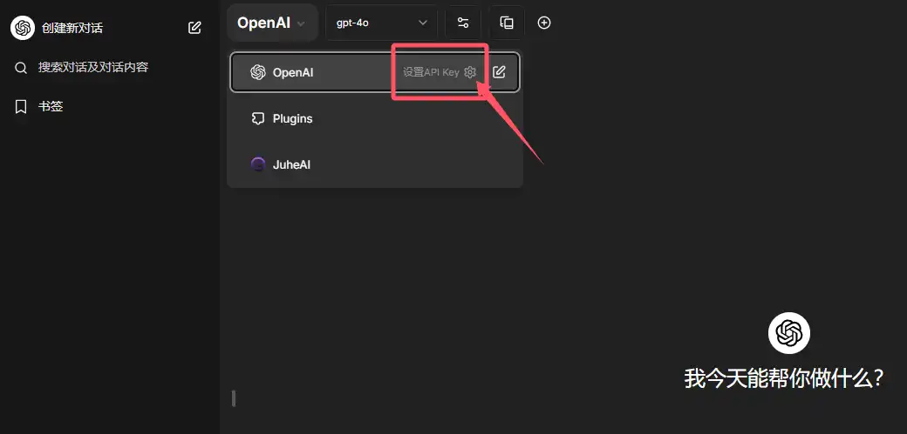
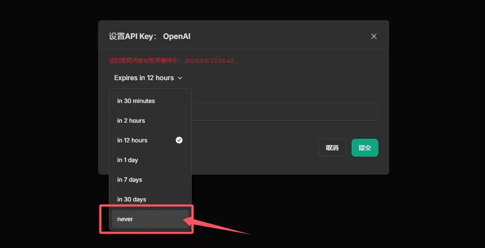

# 购买使用

!> 如果您是第一次接触聚合AI或者仅是AI轻度使用者，我们强烈建议您仅参照简便高效的**标准购买流程部分**下单使用即可。如果您是开发者或中/重度AI使用者，则可考虑联系客服开启管理后台，或考虑协议速刷方式。
<br><br>**重要提示：**由于不可控因素，你可能在官网打不开[API下单购买页面>>](https://www.juheaistore.top)，可以通过[防丢发布页>>](https://www.juheailp.top/)找到最新的下单网址，如果都打不开，还可以联系客服微信ACG508手动处理。<br><br>


## 标准购买流程

### 1. 网站下单

?> **优惠码领取**：下单前可前往微信公众号【产品试金石】点击下方菜单领取优惠码，或者访问[优惠码领取网页](https://www.aijuhe.top/discount-code/)领取。

从[聚合AI官网](https://www.aijuhe.top)菜单处进入下单页面，选择商品支付下单，您将收到1个对应美金额度的API Key。API Key示例：

```
sk-Agn3NqRCo1XKysTV9e10BcAf04Bc46E6A2023823b85991194
```


### 2. 程序配置

打开[聚合AI官网](https://www.aijuhe.top)，找到LibreChat程序入口并打开，根据界面提示注册并登录。


?> **温馨提示**：LibreChat程序注册是必须的步骤，仅需注册一次后续即可自动登录，可享受多端数据共享功能，无论是电脑还是手机使用都非常方便。

登录后，在左上角，根据如图所示，填入API Key即可使用。API Key设置存放失效时间建议为：Never（从不）。





LibreChat使用与部署建议详细阅读：

**[《官方平替！一个支持GPT文档对话和多端同步的免费开源程序LibreChat》](https://www.aijuhe.top/open-source-program-supports-gpt-document-conversation/)**

**[《Librechat快速部署指南》](https://www.aijuhe.top/librechat-easy-deploy-guide/)**

### 3. 余额查询

余额查询入口可访问[聚合AI官网](https://www.aijuhe.top)并在菜单中进入，也可以直接打开余额查询链接 https://https://www.aijuhe.top/juhebill/ ，输入API Key并查询。


!> **注意**：如果您的API Key余额用尽会被系统自动禁用，此时将无法查询，如需查询请联系客服。

### 4. 续费购买

我们建议您在当前API Key用尽额度后直接丢弃，按照上一步新购API Key并更换为新Key继续使用。

如果您不想更换当前API Key，续充并继续使用则请联系客服微信 ACG508 手动处理即可，客服一般全天在线，几乎秒回。

### 5. 发票开具

聚合AI支持为您开具增值税普通发票（发票项目为技术服务类），条件为本季度内累积购买未开票金额大于等于1000元人民币，满足以上条件联系客服申请即可。

## 管理后台（进阶）

[管理后台>>](https://api.juheai.top)在您累积购买聚合AI额度超过100美金后均可永久开启。相较于标准购买流程，操作更为复杂，并不适合普通用户使用。但是管理后台拥有更加丰富的功能管理您的API，如果您有如下需求中的一个或多个，那么开启管理后台则更适合您：

- API一人管理，多人使用；
- 需要自主创建多个不同额度和模型限制的API Key；
- 需要实时、方便的查看API消耗日志和消耗统计；
- 需要API余额提醒；
- 更方便的续费充值；
- 分销代理。

### 1. 申请注册

[管理后台>>](https://api.juheai.top)默认注册入口是关闭的，如果您需要使用管理后台，请首先联系客服微信 ACG508 申请开通账号。


### 2. 余额兑换

注册登录后，系统默认余额为0，请在[XDstore](https://one.mmwcy.cn/)购买获得额度兑换码，并在后台 - 钱包菜单中兑换即可。如果嫌麻烦不希望在线购买，也可以联系客服微信ACG508转账获得余额兑换码。


?> **注意：**钱包余额是你管理后台的真实余额，请保持它始终大于0元方可使用API，你创建的API Key额度将受钱包额度的影响，也就是说，就算你给API Key额度设置了1万美金，钱包余额为0元，API Key照样无法使用。

### 3. 创建API KEY令牌

在管理后台左侧进入令牌菜单，你可以自由创建API Key，操作方法如图所示，创建完成后复制API Key即可使用：


### 4. 日志与统计

在管理后台的日志与数据看板菜单，可以根据日期查看API使用情况（默认为当天的日志）：


### 5. 个人设置

如果需要在余额即将用尽前收到提醒，就需要在管理后台中拥有一个有效接收提醒的邮箱（如果你注册时预留了，那无需再次设置）；同时管理后台还支持修改密码。


至此，你已经完全学会了聚合AI管理后台的使用！

## 协议速刷（进阶）

协议速刷是指聚合AI支持为API大用量用户提供的一种长期合作、更具有性价比的协议供应方案，协议专属线路性能更加稳定，t5级几乎没有并发限制，支持纯官转OpenAI全模型调用，纯官方1:1倍率，均价2元一刀，协议速刷长期成本仅为官方的2.5折左右，您需满足如下条件：

- API调用≥35刀/天，月消耗量在1000刀左右甚至更多；
- API速刷协议至少保持3个月；
- 请求内容需符合中国法律法规及OpenAI使用规范。

!>**注意：**未达到以上条件，下月起将回复普通供货价格。如有违规内容一经查出将立即停止供货，并保留追究法律责任的权利。