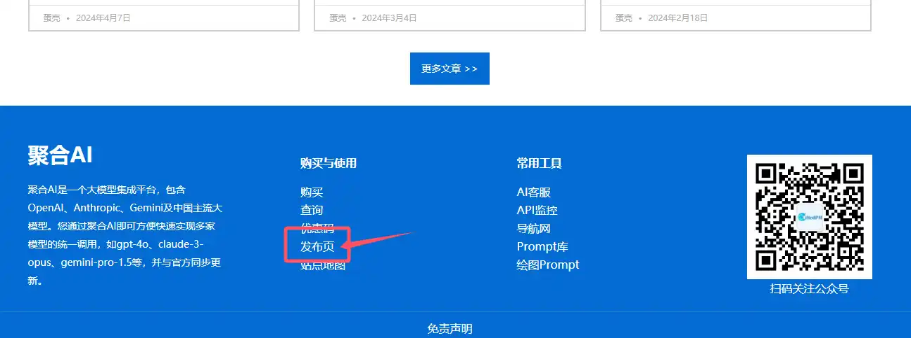
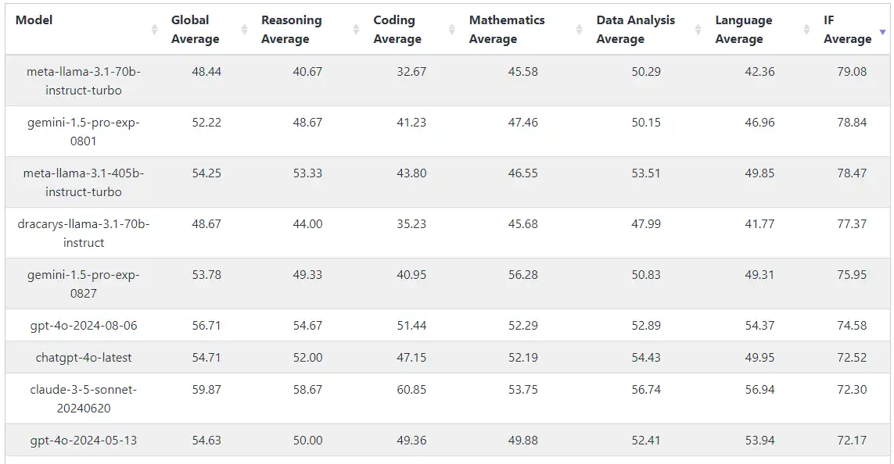

# FAQ

?>本页面收集整理了日常用户遇到的问题及解决办法，帮助你快速上手使用蛋壳AI网站，FAQ内容会保持更新。除了手动翻阅内容外，您还可以直接询问[聚合AI智能客服>>](https://www.gptacg.com/ai-bot/)。

**LibreChat使用常见问题排查**

如果您的LibreChat无法正常使用，请逐一尝试以下方法：

- 尝试新建一个对话
  - 可能原因：当前对话上下文超出了限制
- 尝试左上角更新API-Key信息
  - 可能原因：您的API-Key信息在当前程序已过期
- 确认API-Key是否还有余额，[查询入口>>](https://www.gptacg.com/juhebill/)
  - 可能原因：API-Key额度已用尽
- 尝试关闭VPN后使用
  - 可能原因：VPN造成的网络不稳定

如果以上方式均无法解决请联系客服微信ACG508进一步帮您解决。

**购买页面打不开了怎么办？**

由于国内环境比较严格，购买链接可能出现打不开或者跳反诈页面的可能，遇到此种情况可以联系客服解决或访问发布页找到最新购买地址：

发布页地址：[https://www.juheailp.top/](https://www.juheailp.top/)

也可以从网站首页页脚处找到并访问。

**如何查看模型能力排名并选择使用合适的模型？**

请前往[Livebentch>> ](https://livebench.ai/) 查看最新得分排名，这是一个干净、实时的模型评价排名系统，你可以基于它给出的几项能力评分，再根据自己的需求来选择最佳模型进行使用：

- 全局平均分（Global Average）
- 推理能力（Reasoning Average）
- 编码能力（Coding Average）
- 数学计算（Mathematics Average）
- 数据分析（Data Analysis Average）
- 语言能力（Language Average）
- 综合能力平均分（IF Average）

**如何获取免费公益版NextChat的密码？**

登录微信公众号【产品试金石】，在菜单点击【密码】，公众号会自动回复密码。详细步骤参考[公益版篇>>](../cn/UseFree.md)

---

**如何购买API-Key?**

可以从7*24小时自助购买网站 [https://www.juheaistore.top](https://www.juheaistore.top) 付款购买，付款后系统立即发放对应API-Key。

---

**我购买的API-Key，调用gpt-3.5-turbo模型也扣钱吗？**

扣钱，但是扣得很少，几乎等于免费。想要完全免费可以使用本站部署的公益版NextChat。

---

**本站购买的API-Key支持哪些程序？**

理论上支持所有GPT类程序，像主流的NextChat、LobeChat、ChatGPT-Web、沉浸式翻译、Sider、学术GPT、川虎GPT、虚拟桌面宠物等，对接形式也与OpenAI官方对接保持一致，更改URL接口和填入API-Key即可使用。

---

**使用本站的gpt-4系列，需要挂魔法吗？**

不需要。

---

**本站的API-Key提供的GPT模型、谷歌模型、MJ模型等，都有哪些优势？**

优势几乎是碾压式的：价格不到官方的1/3、无需魔法、无需登录、没有时间限制、没有次数限制、超高并发。

---

**本站的API-Key怎么收费的？**

280元100美金在4turbo模型下，约300万输入+输出汉字量。详细计费标准参考[模型列表篇>>](../cn/Model/Modellist.md.md)

---

**API-Key的消耗情况在哪里查？**

本站查询在菜单可以找到 [余额查询 >>](https://www.gptacg.com/juhebill/) 入口，分别显示余额和消费明细。

---

**本站API有时间限制吗？**

没有时间限制，余额消耗完为止，就算耗完还可以继续续费使用。

---

**是独享吗？**

可以独享也可以共享给身边需要的朋友一块使用，因为支持超高并发，所以多人使用或多端使用并不会造成性能下降，只会影响API-Key的消费速度。

---

**公司使用有什么建议吗？**

单次购买金额大于1000元，提供抬头可以开普票，一般当天就能处理完成。

---

**公司采购API-Key，可以对公打款吗？**

因政策原因暂不支持，仅支持转账至个人银行卡，如果不放心，可以先小额试用。

---

**这个是官方API吗？**

是。官方API经过聚合AI服务器中转至全球每个角落，优化线路速度并达到任何地区均可使用的目的。

---

**你网站上部署的开源程序为什么比我自己部署的模型多？**

我们在部署前修改了代码并优化了部分功能。

---

**API的接口（BASE URL）是多少？**

https://api.juheai.top ,详细说明请参考[应用程序篇>>](../cn/UseApp.md)

---

**使用有50次/3小时或50次/4小时的限制吗？**

没有限制，支持超高并发。

---

**如果我的key里面钱用完或没有余额了，可以直接充值吗？**

可以联系我的微信ACG508提供Key充值，或在 [https://www.juheaistore.top](https://www.juheaistore.top) 自助购买新的key都可以。

---

**我们的AI不能联网吗？**

可以。联网模型可以选择gpt-4-all，您还可以借用联网插件+任意模型实现联网。

---

**我们的GPT如何上传文档？**

推荐您使用本站[LibreChat程序>>](https://lc.gptacg.com)即可上传文档，支持全模型文档分析，详细使用方法建议阅读文章[《官方平替！一个支持GPT文档对话和多端同步的免费开源程序LibreChat》](https://www.gptacg.com/open-source-program-supports-gpt-document-conversation/)；另外，您也可以通过紫色入口NextChat程序上传文档，上传前先把模型切换为gpt-4-all或支持文档分析的GPTs，然后通过【[上传文件](https://up.gptacg.com/upload.php)】入口上传复制url喂给AI程序继续对话。

---

**我支付成功了，但是订单显示已过期，API-Key支付后没有发放怎么办？**

订单异常问题可以加客服微信ACG508快速处理。