# 应用程序

?>随着近两年AI的发展，开源社区[Github](https://github.com/)涌现出了许多优秀的开源AI程序项目，用户可以基于自身需要选择合适的开源AI程序进行使用，经实践发现，支持OpenAI Compatible（OpenAI兼容）的程序均可使用本站API，很庆幸大部分AI程序都在这样做。统一接入方式：Base_Url接口 + API Key。

API接口视程序情况而定，一般存在以下三种情况，其中绝大部分是第一种情况：
```
https://api.juheai.top
https://api.juheai.top/v1
https://api.juheai.top/v1/chat/completions
```

下面我们将列出一部分优秀AI应用程序的配置方法，以帮助用户节约时间快速使用程序：

## LibreChat

>**介绍：**外国人的项目，仿GPT PLUS界面UI的ChatUI程序，迄今为止最为强大的ChatUI，程序最牛逼的地方在于支持丰富的AI功能，对话、RAG分析文件、插件、语音、多端同步样样都行。
><br> **项目地址：** https://github.com/danny-avila/LibreChat</br>

**配置：**一般登录程序后仅需要填写API Key即可，访问入口： https://lc.gptacg.com 。如需自行部署，可以参考文章[《Librechat快速部署指南》](https://www.gptacg.com/librechat-easy-deploy-guide/)。

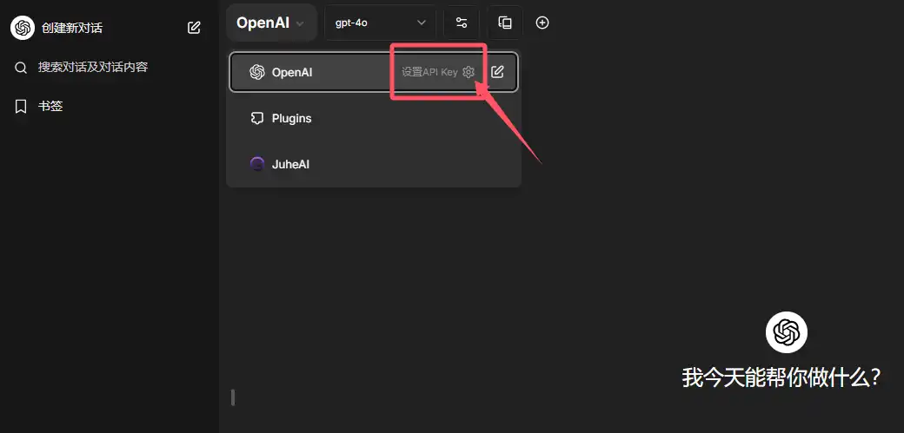

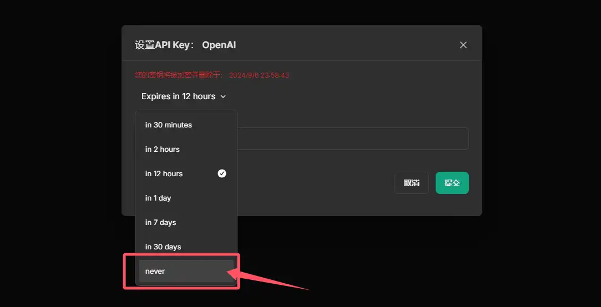

## NextChat

>**介绍：**这是一个中国大佬的项目，因为做的太丝滑团队导致被收购了，目前新的团队也出了商业版本，不过失去了大佬的创作，商业版风格直接变了味，还是开源版比较舒服。
><br> **项目地址：** https://github.com/ChatGPTNextWeb/ChatGPT-Next-Web</br>

**配置：**需要在设置中勾选自定义接口，并填写接口地址：https://api.juheai.top 和 API KEY，访问入口： https://vvip.gptacg.com 。如需自行部署，可参考文章[《通过NextChat(ChatGPT-Next-Web)低成本给自己或客户部署GPT程序》](https://www.gptacg.com/deploy-a-low-cost-gpt-program/)

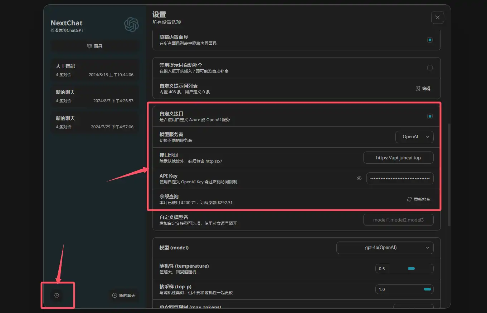

## Dooy-AI

>**介绍：**github原名叫chatgpt-web-midjourney-proxy，作者是Dooy，项目名字又长识别度又低，索性咱们以作者名字冠名更朗朗上口，这个项目除了支持chat外，还支持midjourney绘图、suno音乐、luma视频创作的可视化操作，可玩性极高。
><br> **项目地址：** https://github.com/Dooy/chatgpt-web-midjourney-proxy</br>

**配置：**需要在设置中填写接口地址：https://api.juheai.top 和 API Key，访问入口：https://dooy.gptacg.com 。如需自行部署，可参考文章[《拥有私人GPT：chatgpt-web-midjourney-proxy完整部署指南》](https://www.gptacg.com/chatgpt-web-midjourney-proxy-complete-deployment-guide/)

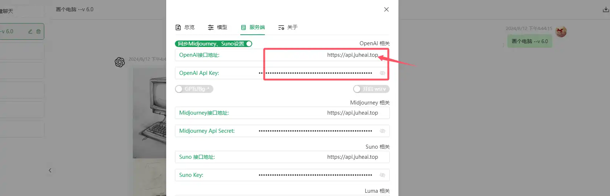

## LobeChat

>**介绍：**现代化设计的开源 ChatGPT/LLMs 聊天应用与开发框架，支持语音合成、多模态、可扩展的（function call）插件系统，一键免费拥有你自己的 ChatGPT/Gemini/Claude/Ollama 应用。
><br> **项目地址：** https://github.com/lobehub/lobe-chat</br>

**配置：**需要在设置中填写接口地址：https://api.juheai.top/v1 和API Key，访问入口：https://lobe.gptacg.com 。

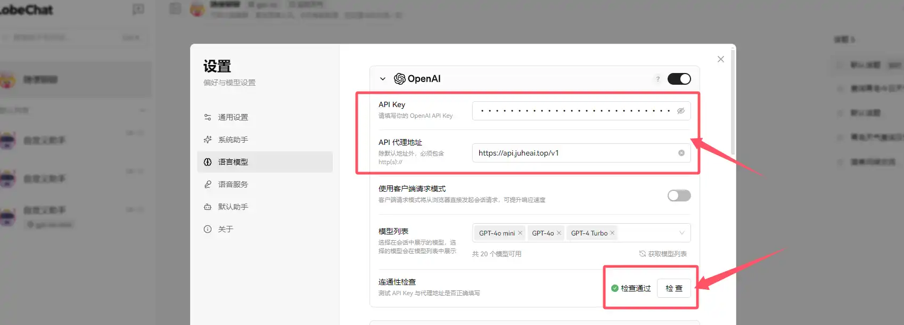

## Chatbox

>**介绍：**Chatbox AI 是一款 AI 客户端应用和智能助手，支持众多先进的 AI 模型和 API，可在 Windows、MacOS、Android、iOS、Linux 和网页版上使用。
><br> **项目地址：** https://github.com/Bin-Huang/chatbox</br>

**配置：**需要在设置中选择OPENAI API，填写API域名： https://api.juheai.top 和API Key，下载并安装客户端进行本地使用。

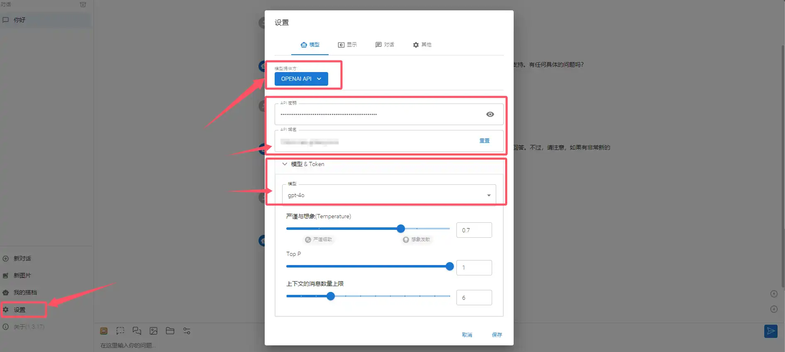

## 沉浸式翻译

>**介绍：**全网口碑炸裂的双语对照网页翻译插件。你可以完全免费地使用它来实时翻译外语网页，PDF翻译，EPUB电子书翻译，视频双语字幕翻译等。还可以自由选择调用OpenAI (ChatGPT)、DeepL、Gemini等人工智能引擎来翻译上述内容。在手机上也可以随时随地用哦，真正帮助你打破信息壁垒。
><br> **项目地址：** https://github.com/immersive-translate/immersive-translate</br>

**配置：**安装沉浸式翻译浏览器插件后，在设置中选择OpenAI，并按照图示填写API Key和自定义API接口地址：https://api.juheai.top/v1/chat/completion ，即可开始使用。

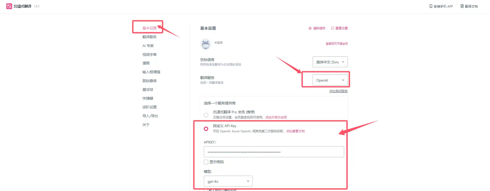

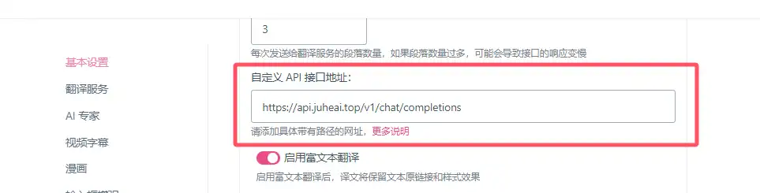

## ChatGPTBox

>**介绍：**将ChatGPT深度集成到浏览器中, 你所需要的一切均在于此。起初以为这只是一个单纯的浏览器页面翻译插件，直到用起来才发现它不止于此，我觉得它的页面总结和对话的能力更为出色，当然还有更多功能等你发掘。
><br> **项目地址：** https://github.com/josStorer/chatGPTBox</br>

**配置：**安装ChatGPTBox插件后，在高级 - API地址菜单中填写自定义OpenAI API地址：https://api.juheai.top ，然后进入常规菜单，在API模式中输入API Key和对应的模型即可使用。

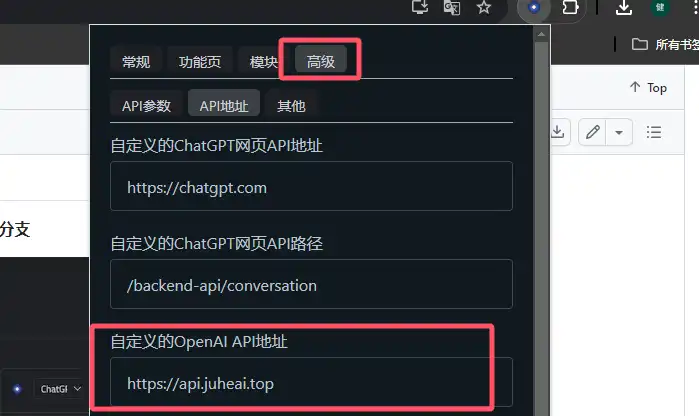

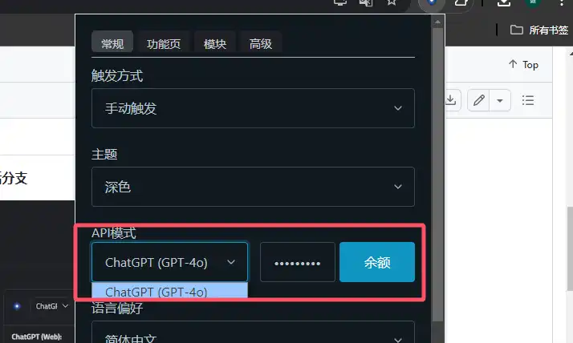

## chatgpt-on-wechat

>**介绍：**基于大模型搭建的聊天机器人，同时支持 微信公众号、企业微信应用、飞书、钉钉 等接入，可选择GPT3.5/GPT-4o/GPT4.0/ Claude/文心一言/讯飞星火/通义千问/ Gemini/GLM-4/Claude/Kimi/LinkAI，能处理文本、语音和图片，访问操作系统和互联网，支持基于自有知识库进行定制企业智能客服。
><br> **项目地址：** https://github.com/zhayujie/chatgpt-on-wechat</br>

**配置方式一：**如果你是docker-compose方式部署，在docker/docker-compose.yml文件中添加如下环境变量：

```
<!-- 其它参数项 -->
environment:
      OPEN_AI_API_KEY: 'sk-xxx'
      OPEN_AI_API_BASE: 'https://api.juheai.top/v1'
<!-- 其它参数项 -->
```

**配置方式二：**如果直接Python部署，则在config.json文件中添加

```
<!-- 其它参数项 -->
"open_ai_api_key": "sk-xxx",
"open_ai_api_base": "https://api.openai.com/v1",
<!-- 其它参数项 -->

```

## 酒馆SillyTavern


>**介绍：**看图明意，这是一个可以依托于大模型进行角色扮演的程序，没玩过，感兴趣可以研究研究，聚合AI是完全支持API接入的。
><br> **项目地址：** https://github.com/SillyTavern/SillyTavern</br>

**配置方式：**设置中输入自定义端点：https://api.juheai.top/v1 ，和自定义API密钥。

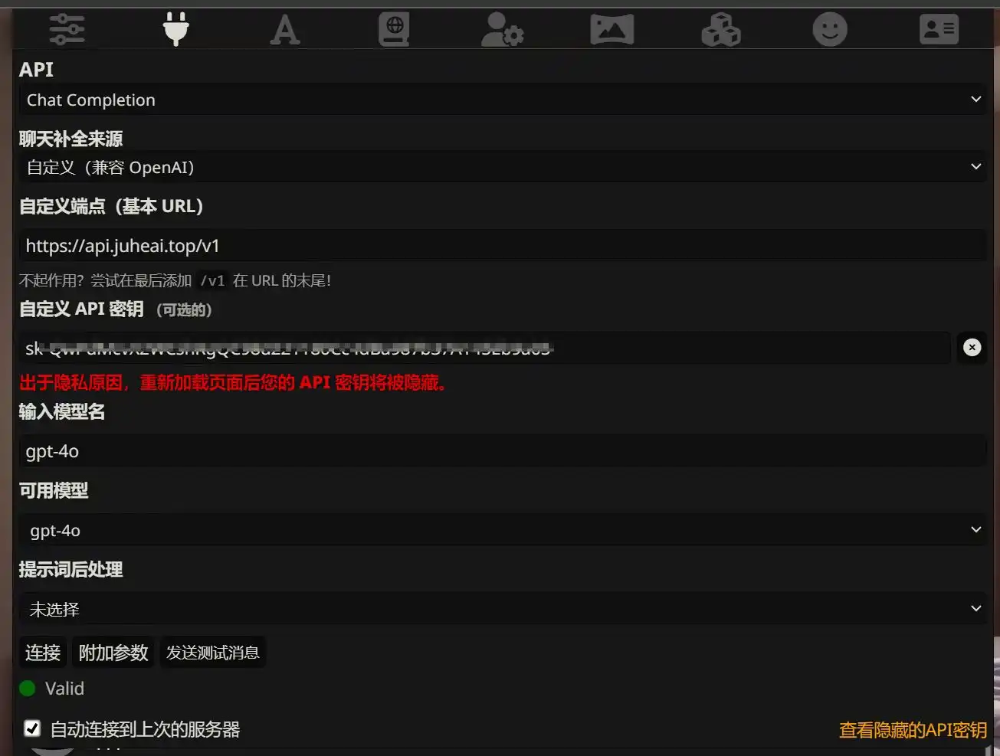

## openai-translator

>**介绍：**既是浏览器插件也是跨平台桌面端应用，基于 ChatGPT API 的划词翻译浏览器插件和跨平台桌面端应用。
><br> **项目地址：** https://github.com/openai-translator/openai-translator</br>

**配置方式：**设置中输入API URL：https://api.juheai.top 和API密钥。

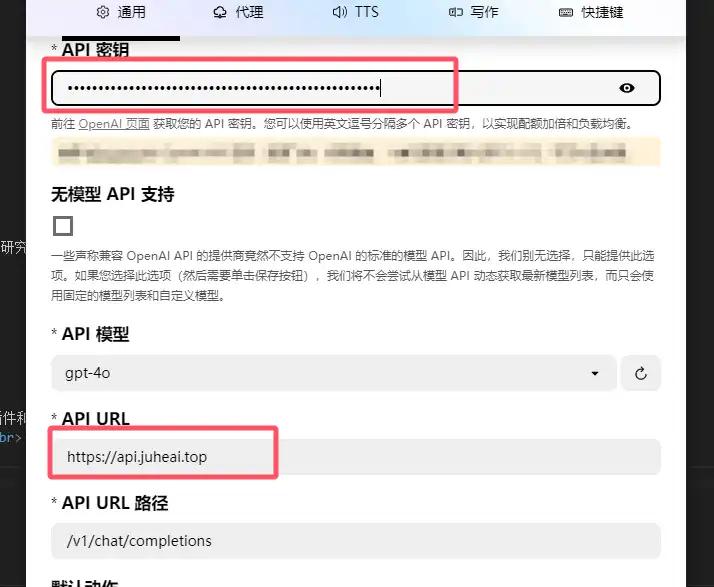

## continue

>**介绍：**continue是领先的开源 AI 代码助手。你可以连接任何模型和任何上下文，在 VS Code 和 JetBrains 里面构建自定义的自动补全和聊天体验。
><br> **项目地址：** https://github.com/continuedev/continue</br>

**配置方式：**安装IDE的continu插件，并在config.json文件中输入如下内容（原自带内容删除）：

```
{
  "models": [
    {
      "title": "JuheAI",
      "provider": "openai",
      "model": "gpt-4o",
      "apiBase": "https://api.juheai.top/v1",
      "apiType": "openai",
      "apiKey": "sk-xxx"
    }
  ]
}
```

## fastgpt

>**介绍：**基于 LLM 大语言模型的知识库问答系统，提供开箱即用的数据处理、模型调用等能力。同时可以通过 Flow 可视化进行工作流编排，从而实现复杂的问答场景！
><br> **项目地址：** https://github.com/labring/FastGPT</br>

**配置方式：**在对应的文件，Docker Compose部署是在files/docker/docker-compose.yml文件中，部署启动前修改对应的接口和API Key即可。无需部署one-api程序。

```
<!-- 其它配置 -->
      # AI模型的API地址哦。务必加 /v1。这里默认填写了OneApi的访问地址。
      - OPENAI_BASE_URL=https://api.juheai.top/v1
      # AI模型的API Key。（这里默认填写了OneAPI的快速默认key，测试通后，务必及时修改）
      - CHAT_API_KEY=sk-xxx
<!-- 其它配置 -->
```

## dify

>**介绍：**Dify 是一个开源的 LLM 应用开发平台。其直观的界面结合了 AI 工作流、RAG 管道、Agent、模型管理、可观测性功能等，让您可以快速从原型到生产。
><br> **项目地址：** https://github.com/langgenius/dify</br>

**配置方式：**登录程序后，在设置中选择openai-api-compatible，并按照图示设置即可。

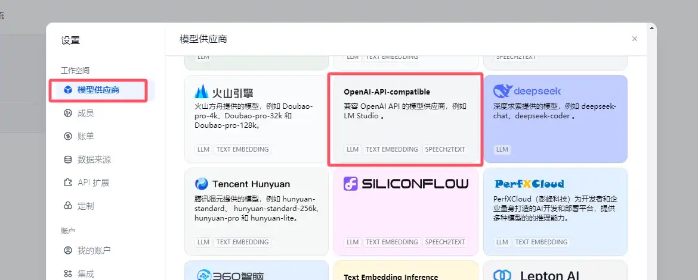

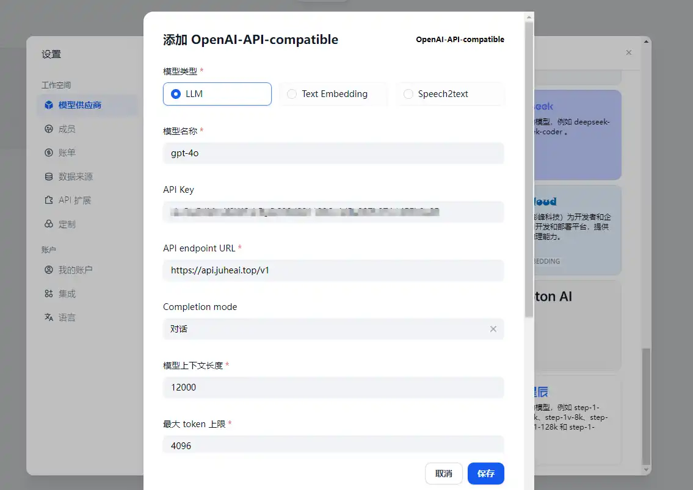

## gpt_academic

>**介绍：**为GPT/GLM等LLM大语言模型提供实用化交互接口，特别优化论文阅读/润色/写作体验，模块化设计，支持自定义快捷按钮&函数插件，支持Python和C++等项目剖析&自译解功能，PDF/LaTex论文翻译&总结功能，支持并行问询多种LLM模型，支持chatglm3等本地模型。接入通义千问, deepseekcoder, 讯飞星火, 文心一言, llama2, rwkv, claude2, moss等。
><br> **项目地址：** https://github.com/binary-husky/gpt_academic</br>

**配置方式：**启动程序前，在config.py中修改以下两个环境变量参数：

```
API_KEY = "sk-xxx"
API_URL_REDIRECT = {"https://api.openai.com/v1/chat/completions": "https://api.juheai.top/v1/chat/completions"}
```

## AnythingLLM

>**介绍：**您一直在寻找的全方位AI应用程序。与您的文档聊天，使用AI代理，高度可配置，多用户，无需繁琐的设置。
><br> **项目地址：** https://github.com/Mintplex-Labs/anything-llm</br>

**配置方式：**在设置中，可以配置LLM首选项、Embedder首选项，设置LLM提供尚为Generic OpenAI，BaseURL设置为：https://api.juheai.top/v1 ，ChatModelName建议填写：gpt-4o，Embedding Model建议填写：text-embedding-ada-002，Token context window和Max Tokens、Max embedding chunk length按如图数字所示设置即可：

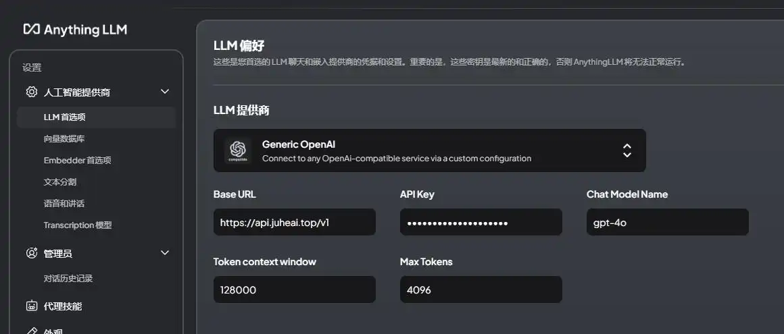

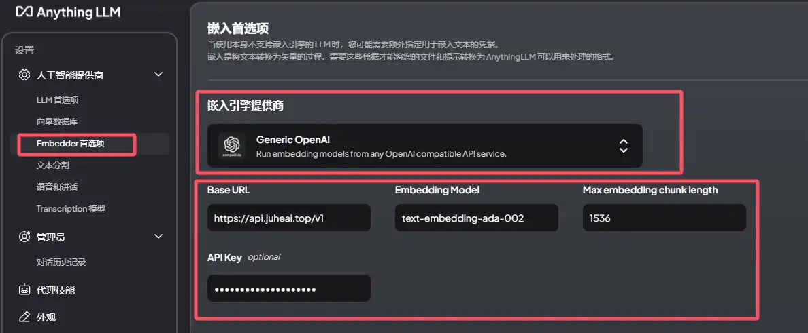

## OpenWebUI

>**介绍：**Open WebUI 是一个可扩展、功能丰富且用户友好的自托管 WebUI，设计完全离线运行。它支持各种 LLM 运行器，包括 Ollama 和兼容 OpenAI 的 API。欲了解更多信息，请查阅我们的 Open WebUI 文档。
><br> **项目地址：** https://github.com/open-webui/open-webui</br>

**配置方式：**将环境变量中的OPENAI_API_BASE_URLS替换为https://api.juheai.top/v1即可。

<!-- tabs:start -->

#### **Docker Run**

```
docker run -d -p 3000:8080 \
  -v open-webui:/app/backend/data \
  -e OPENAI_API_BASE_URLS="https://api.juheai.top/v1" \
  -e OPENAI_API_KEYS="sk-xxx" \
  --name open-webui \
  --restart always \
  ghcr.io/open-webui/open-webui:main
```

#### **Docker Compose**

```
services:
  open-webui:
    environment:
      - 'OPENAI_API_BASE_URLS=https://api.juheai.top/v1'
      - 'OPENAI_API_KEYS=sk-xxx'
```

<!-- tabs:end -->

## BotGem问天

>**介绍：**BotGem是一款智能聊天助手应用，支持PC端和手机端多个系统，使用先进的自然语言处理技术来理解和回应你的文字信息。你可以使用BotGem提问、分享想法、寻求建议或只是随意聊天。
><br> **项目地址：** https://botgem.com/</br>

**配置方式：**打开设置并修改API Server和API Key即可。

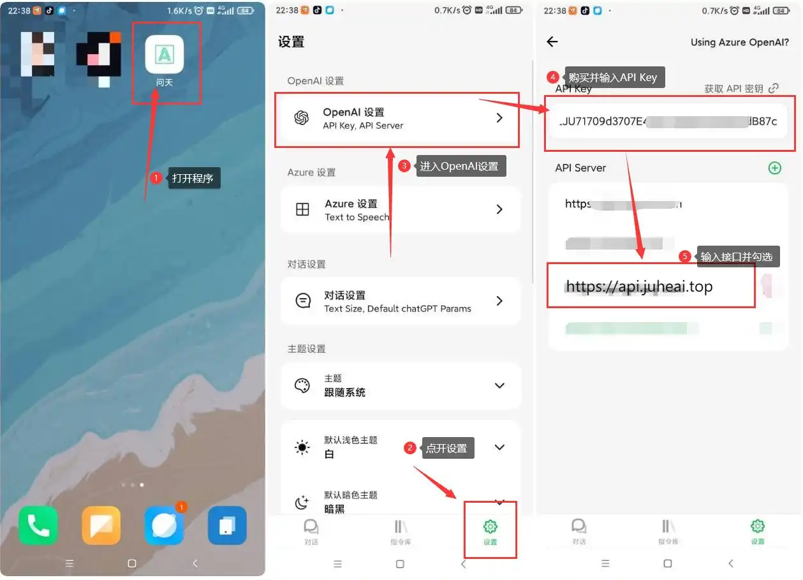

## DrawAI

>**介绍：**一个可以批量生成DALLE图像的AI生图工具，支持OpenAI兼容端点（中转API）。
><br> **项目地址：** https://github.com/sunsky89757/DrawAI</br>

**配置方式：**打开设置API接口地址和API Key即可。

?>开源程序来之不易，希望各位在使用后，去项目地址给作者点点star，我们也会陆续增加更多已支持的开源AI程序，如果您有使用过好的开源AI项目，也欢迎与我们联系进行补充。