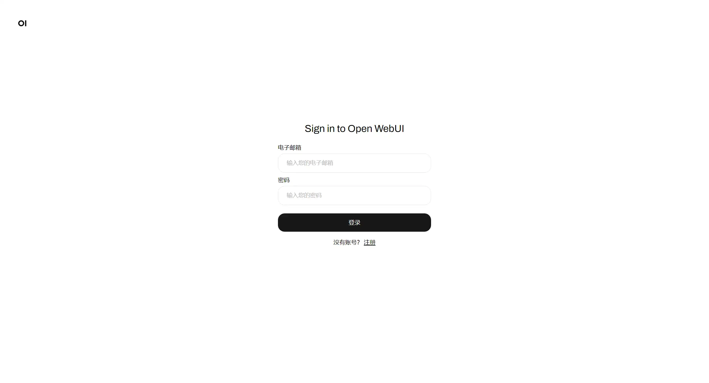
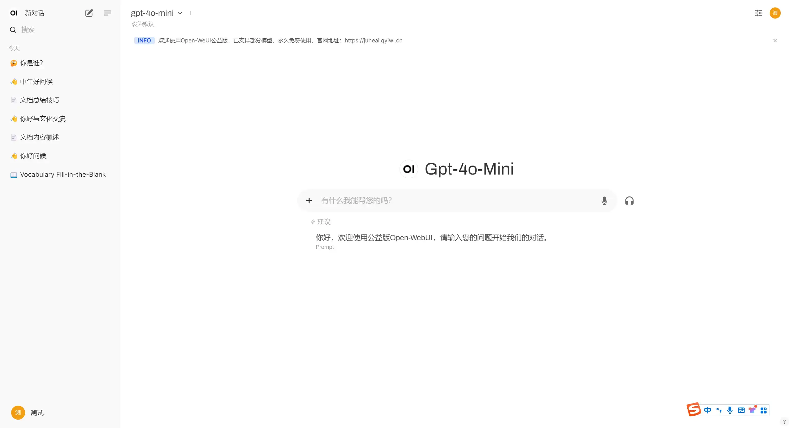
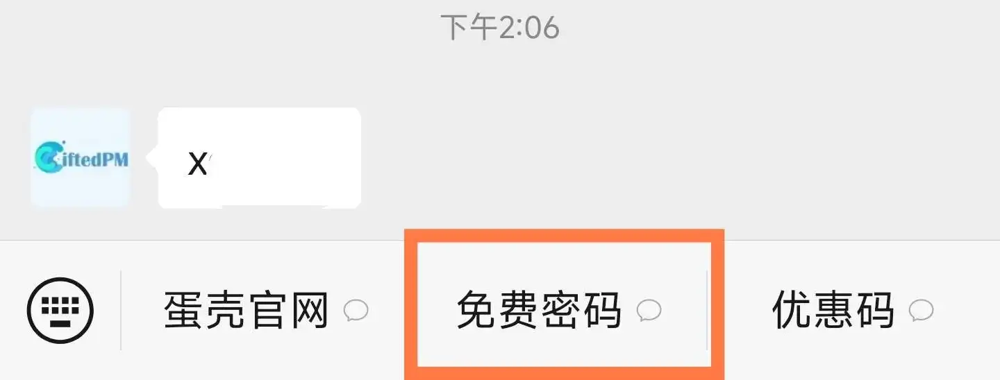
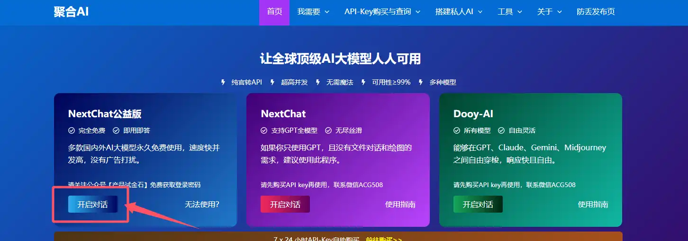
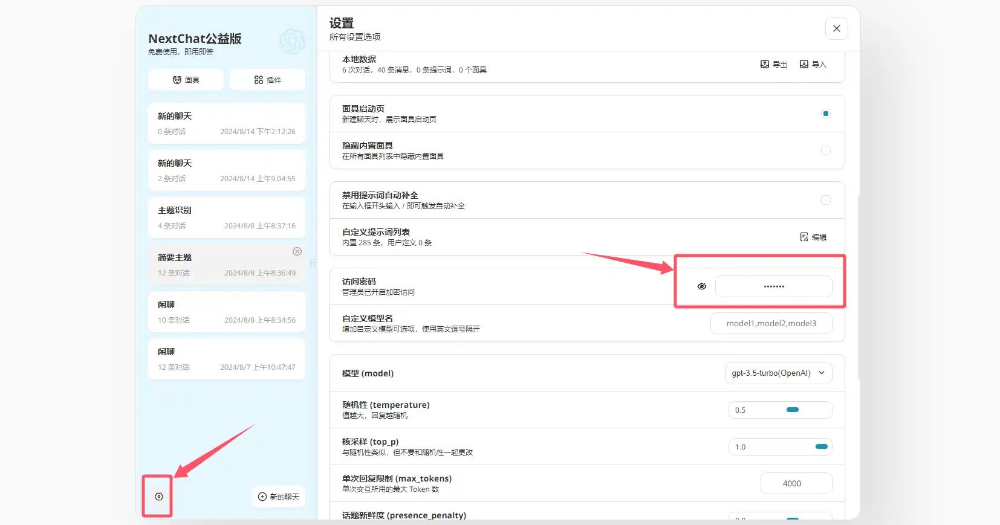

# 公益版

?>聚合AI为您永久免费提供Chat公益版AI进行日常在线使用，支持多个国内外AI大模型，不定期更新增加新的免费模型，没有广告打扰。公益版暂不支持API。

## 新版使用方法

### 1. 注册账号

访问聚合AI官网并从Open-WebUI公益版入口进入注册。

### 2. 登录使用

注册后登录即可开始使用，新版公益Open-WebUI在支持原有模型基础上，更换为全新的项目UI，界面美观，同时还支持文件上传与语音功能。

### 3. 支持模型

**对话模型：**

- gpt-3.5-turbo
- gpt-4o-mini
- deepseek-chat
- llama-3.1-70b
- claude-3-5-sonnet-20240620

**语音模型：**

- tts-1
- whisper-1

**向量模型：**

- sentence-transformers/all-MiniLM-L6-v2

### 4. 注意事项

- 新版公益版本，加入了语音与向量模型，可用性更高
- 新版支持多端同步，数据不会丢失
- 为了更好地性能分配，新版做了并发限制，每人享有6 rpm和120 tpm，请合理使用
- 新版取消了密码访问
- 新版拥有更高的服务器可用性能
- 版本使用教程与更多AI应用文章，请持续关注公众号【产品试金石】更新

## 老版使用方法

### 1. 领取密码

关注微信公众号**产品试金石**，点击菜单“免费密码”领取密码。

### 2. 打开程序

打开[聚合AI官网](https://www.gptacg.com/),从如图位置入口进入公益版NexChat程序。

### 3. 输入密码并使用

进入程序的设置里，输入密码即可开始使用。

### 4. 支持模型

- gpt-3.5-turbo
- gpt-4o-mini
- deepseek-chat
- llama-3.1-70b
- claude-3-5-sonnet-20240620

